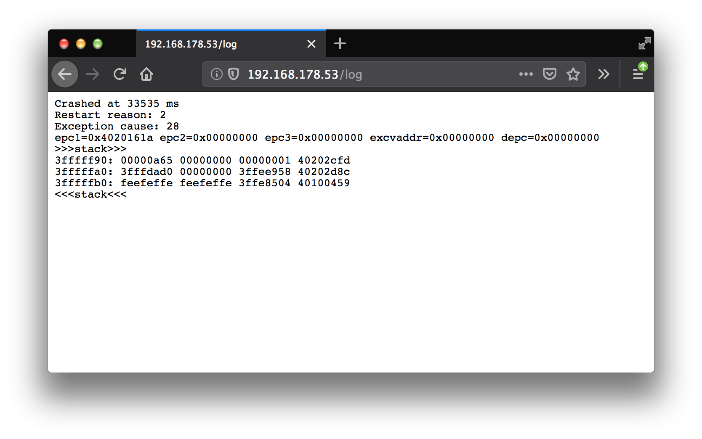

# EspSaveCrashSpiffs
<!-- [](https://travis-ci.org/brainelectronics/EspSaveCrashSpiffs) -->

Save exception details and stack trace to SPIFFS everytime the ESP8266 crashes. Implement it in your sketch in two simple steps.


## Overview

EspSaveCrashSpiffs is another handy little library that will keep automatically catching and saving crash information to ESP8266 module's flash in case it fails due to exception or software WDT. You will then be able to analyze the crash log and decode the stack trace using [ESP Exception Decoder](https://github.com/me-no-dev/EspExceptionDecoder).

This library is inspired by the [EspSaveCrash library](https://github.com/krzychb/EspSaveCrash) written by [krzychb](https://github.com/krzychb).

You will implement it in your sketch in two simple steps:

1. Include the library
  ```cpp
  #include "EspSaveCrashSpiffs.h"
  ```

2. Declare object
  ```cpp
EspSaveCrashSpiffs SaveCrashSpiffs(0);
```

That's it.

To print out the latest crash log to Serial use this:
  ```cpp
  // allocate some space for the latest log filename
  char* _lastCrashFileName;
  _lastCrashFileName = (char*)calloc(255, sizeof(char));

  // get the last filename
  SaveCrashSpiffs.getLastLogFileName(_lastCrashFileName);

  Serial.printf("Name of last log file: '%s'\n", _lastCrashFileName);

  Serial.println("--- BEGIN of crash file ---");
  SaveCrashSpiffs.print(_lastCrashFileName);
  Serial.println("--- END of crash file ---");

  // free the allocated space
  free(_lastCrashFileName);
  ```

Example serial output might be something like this:
  ```
 Name of last log file: '/crashLog-5.log'
--- BEGIN of crash file ---
Crashed at 33535 ms
Restart reason: 2
Exception cause: 28
epc1=0x4020161a epc2=0x00000000 epc3=0x00000000 excvaddr=0x00000000 depc=0x00000000
>>>stack>>>
3fffff90: 00000a65 00000000 00000001 40202cfd
3fffffa0: 3fffdad0 00000000 3ffee958 40202d8c
3fffffb0: feefeffe feefeffe 3ffe8504 40100459
<<<stack<<<

--- END of crash file ---
  ```

The browser output looks like that:


To delete existing crash files from the flash refer to the `deleteSomeFile()` function in the [SimpleCrashSpiffs](https://github.com/brainelectronics/EspSaveCrashSpiffs/blob/master/examples/SimpleCrashSpiffs/SimpleCrashSpiffs.ino) example.

Check the examples folder for sample implementation of this library and tracking down where the program crash happened. Also an example to show how to access to latest saved information remotely with a web browser.


## Compatibility

* Library works with any ESP8266 module programmed using [esp8266 / Arduino](https://github.com/esp8266/Arduino) core.


## Functionality

* Registers callback to automatically capture and save crash details
* Captures several crashes to save them to ESP8266 module's flash
* Captures exceptions and software WDT restarts (not hardware WDT)
* The following information is saved:
  * Time of crash using the ESP's milliseconds counter
  * Reason of restart - see [rst cause](https://arduino-esp8266.readthedocs.io/en/latest/boards.html#rst-cause)
  * Exception cause - see [EXCCAUSE](https://arduino-esp8266.readthedocs.io/en/latest/exception_causes.html)
  * `epc1`, `epc2`, `epc3`, `excvaddr` and `depc`
  * Stack trace in format you can analyze with [ESP Exception Decoder](https://github.com/me-no-dev/EspExceptionDecoder)
* Automatically arms itself to operate after each restart or power up of module
* Saves crash file to default file and renames this to the next logical name after a reboot. Small files avoid reboots due to buffer overflow or out of RAM stuff.


## Examples

Library comes with [example sketches](https://github.com/krzychb/EspSaveCrash/tree/master/examples) that let you trigger some exceptions and see how to visualize saved data.

Please check separate section [how to use example sketches](examples.md) and what particular functionality they provide.


## Tested With

### Arduino Core

* [Esp8266 / Arduino](https://github.com/esp8266/Arduino) core [2.3.0](https://github.com/esp8266/Arduino/releases/tag/2.3.0) for Arduino IDE and Visual Micro
* [framework-arduinoespressif](http://platformio.org/platforms/espressif) version 13 for PlatformIO


### Programming Environment

* [Arduino IDE](https://www.arduino.cc/en/Main/Software) 1.6.9 portable version running on Windows 7 x64
* [PlatformIO IDE](http://platformio.org/platformio-ide) 1.3.0 CLI 2.11.0 running on Windows 7 x64
* [Visual Micro](http://www.visualmicro.com/) 1606.17.10 with Visual Studio Community 2015 running on Windows 7 x64


## Installation

* Arduino IDE - use [Library Manager](https://www.arduino.cc/en/Guide/Libraries#toc2) in Arduino IDE and search for *EspSaveCrash*.
* PlatformIO IDE - use PlatformIO's [Library Manager](http://docs.platformio.org/en/stable/librarymanager/). In particular execute `pio lib install 376`.
* Visual Micro - installation procedure is the same as for Arduino IDE above.


## Contribute

Feel free to contribute to the project in any way you like!

If you find any issues with code or descriptions please report them using *Issues* tab above.


## Author

brainelectronics


## Credits

* Big thanks to krzychb who inspired me to extend it's great [EspSaveCrash](https://github.com/krzychb/EspSaveCrash) library to use now the SPIFFS
* Preparation of this library has been inspired by issue [#1152](https://github.com/esp8266/Arduino/issues/1152) in [esp8266 / Arduino](https://github.com/esp8266/Arduino) repository.


## License

[GNU LESSER GENERAL PUBLIC LICENSE - Version 2.1, February 1999](LICENSE)
